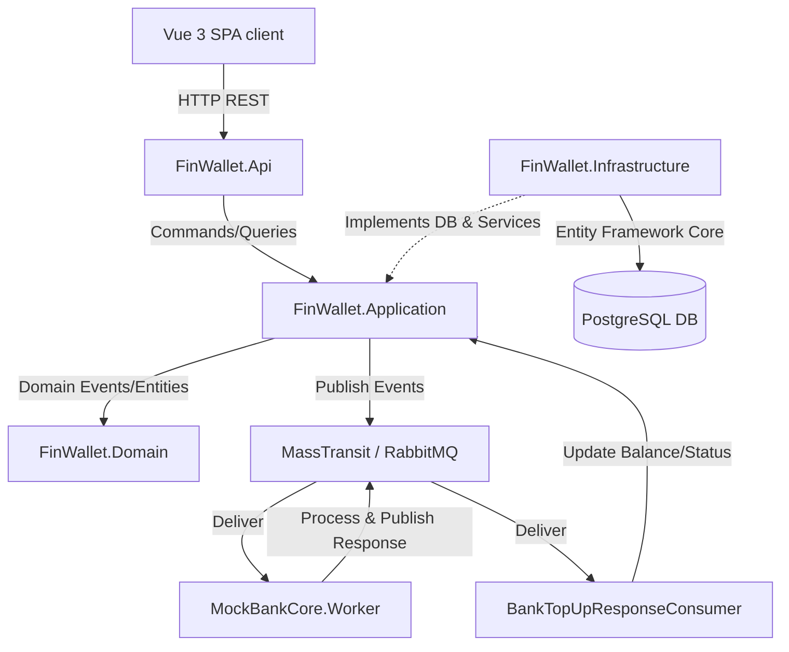
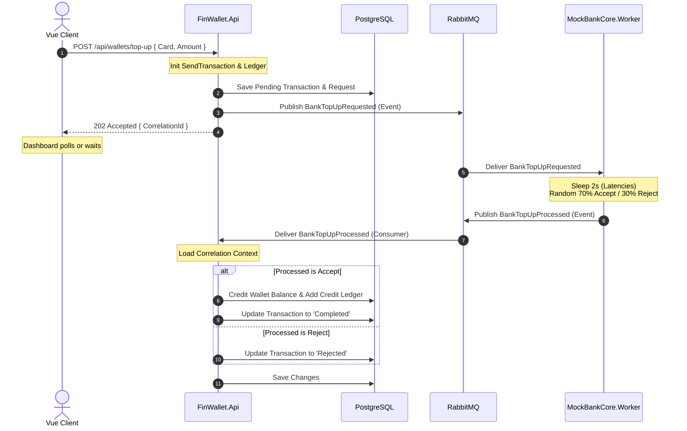

# 02. System Architecture & Design

This document details the software architecture, boundaries, and communication flows of **FinWallet**.

---

## 1. High-Level Modular Monolith Architecture
FinWallet uses a **Clean Architecture** style organized as a modular monolith. This ensures that business logic remains independent of databases, web frameworks, and external services.

---

## 2. Project Boundaries & Responsibilities

The Solution (`FinWallet.slnx`) separates duties into explicit project assemblies:

### 1. `FinWallet.Domain` (Core)
- **Dependencies**: None.
- **Contents**: Pure entities (`Wallet`, `Transaction`, `LedgerEntry`, `Receipt`, `AuditLog`), domain exceptions, enums (`WalletStatus`, `TransactionType`), and core business constants.
- **Role**: Standardizes business logic and constraints (e.g., preventing negative balance transitions).

### 2. `FinWallet.Contracts` (Integration Events)
- **Dependencies**: None.
- **Contents**: Message record schemas used for communication between the API and the Mock Bank Core worker (`BankTopUpRequested`, `BankTopUpProcessed`).
- **Role**: Serves as a shared contract layer.

### 3. `FinWallet.Application` (Business Orchestration)
- **Dependencies**: `FinWallet.Domain`, `FinWallet.Contracts`, MediatR, FluentValidation.
- **Contents**: Commands & Queries (handlers), DTO definitions, FluentValidation rules, pipeline behaviors.
- **Role**: Coordinates business processes, validates inputs, and ensures security access levels.

### 4. `FinWallet.Infrastructure` (Data & External Services)
- **Dependencies**: `FinWallet.Application`, Entity Framework Core, ASP.NET Core Identity.
- **Contents**: `ApplicationDbContext`, EF Core migrations, database schemas, JWT token creation services, MassTransit/RabbitMQ transport setup, database seeding utilities.
- **Role**: Handles database interactions, auth helpers, and system integrations.

### 5. `FinWallet.Api` (Presentation Entrypoint)
- **Dependencies**: `FinWallet.Infrastructure`.
- **Contents**: REST API Controllers, global error handling middleware, CORS policies, Swagger configuration.
- **Role**: Serializes HTTP requests and maps them to Application Command/Query models.

### 6. `FinWallet.MockBankCore.Worker` (External Simlulation)
- **Dependencies**: `FinWallet.Contracts`, MassTransit.
- **Contents**: MassTransit consumers and workers.
- **Role**: Simulates a banking core. It receives top-up requests, pauses for 2 seconds to simulate network latency, and fires a response based on a random 70% approval rate.

### 7. `FinWallet.Tests` (Quality Assurance)
- **Dependencies**: All projects.
- **Contents**: Integration tests validating multi-step transaction commands, security rules, and ledger calculations.

---

## 3. Communication Patterns & Integration Flows

### Flow A: Peer-to-Peer Transfer (Synchronous Atomic Flow)
In-system wallet-to-wallet transfers must occur synchronously and remain fully atomic to prevent double-spending.

1. **Client** issues POST `/api/transfers` with destination wallet number and amount.
2. **Api** validates JWT session and dispatches `SendMoneyCommand` via MediatR.
3. **Pipeline Behavior** opens an EF Core transaction context.
4. **Command Handler**:
   - Fetches and locks (optimistically/pessimistically) the sender and receiver wallets.
   - Asserts that both wallets are active, not frozen, and that the sender has sufficient balance.
   - Deducts amount from Sender balance and adds it to Receiver balance.
   - Generates two ledger entries (`Debit` for sender, `Credit` for receiver).
   - Records a `Completed` Transaction history entity and a printable `Receipt`.
   - Records an `AuditLog` entry.
5. **Transaction Behavior** commits the EF Core transaction, saving all changes to the database as a single transaction block.
6. **Client** receives a `200 OK` HTTP status response containing receipt details.

### Flow B: Simulated External Top-Up (Asynchronous Event-Driven Flow)
Top-up commands depend on external bank authorization and run asynchronously via RabbitMQ to demonstrate microservices-like operations.

This demonstrates the decoupling of user action from external network dependencies.
