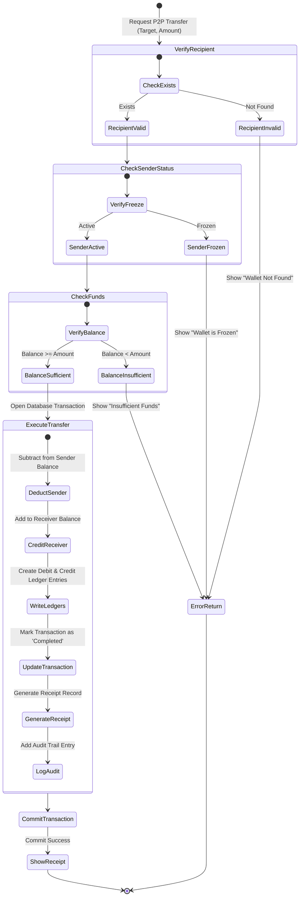
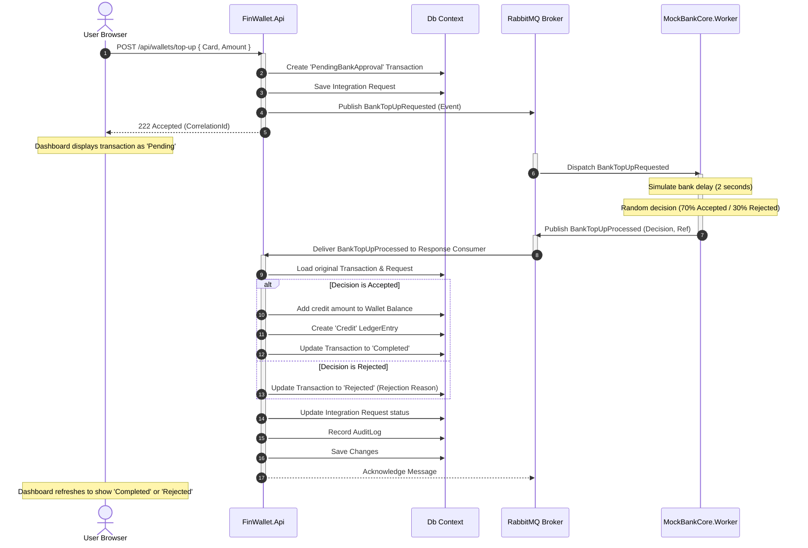
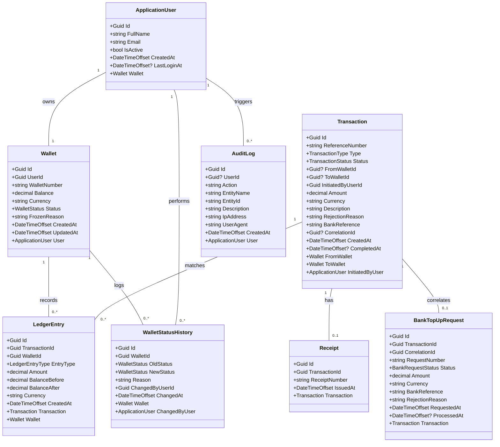
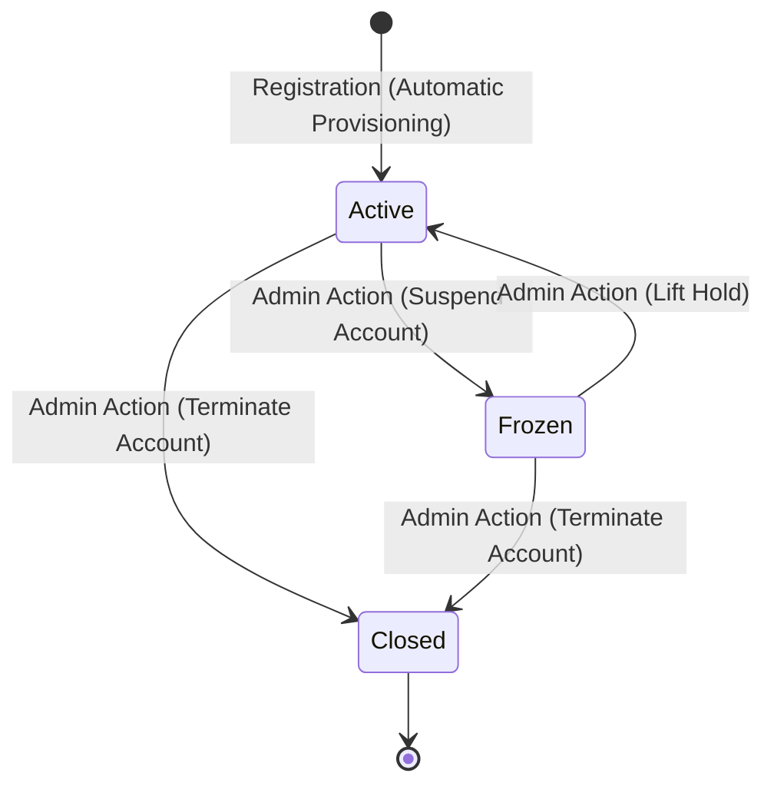
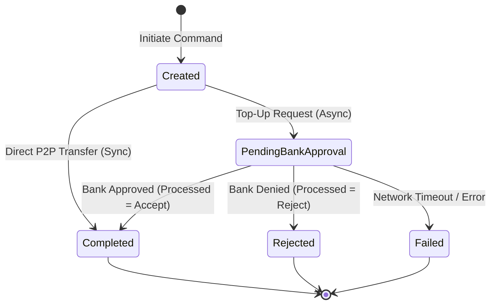

# 05. UML Technical Specifications

This document outlines the system diagrams of **FinWallet** using standard UML notation written in Mermaid.

---

## 1. Use Case Diagram
Describes the actions that Customers and Administrators can perform on the platform.

```mermaid
left-to-right-direction
actor Customer
actor Administrator

rectangle FinWalletSystem {
    Customer --> (Register & Log In)
    Customer --> (View Wallet Balance)
    Customer --> (Request Asynchronous Top-Up)
    Customer --> (Transfer Funds to Peer)
    Customer --> (View Transaction History)
    Customer --> (Print Digital Receipt)

    (Request Asynchronous Top-Up) .-> (Simulate External Bank Processing) : <<include>>
    (Transfer Funds to Peer) .-> (Debit Sender & Credit Receiver) : <<include>>

    Administrator --> (View Global Analytics Dashboard)
    Administrator --> (Search Users Directory)
    Administrator --> (Freeze / Unfreeze Wallets)
    Administrator --> (Audit System Transactions)
    Administrator --> (View Security Audit Logs)
}
```

---

## 2. Activity Diagram: P2P Fund Transfer
Details the logic and checks performed when transferring money between two accounts.



---

## 3. Sequence Diagram: Top-Up Process
Shows the chronological message exchange for an asynchronous top-up.



---

## 4. Class Diagram
Represents the core models and their relationships inside the domain layer.



---

## 5. State Machine Diagram: Wallet & Transactions

### Wallet Status Transitions


### Transaction Status Transitions


---

## 6. Component Diagram
Shows how different technical layers and services fit together.

```mermaid
graph LR
    subgraph FrontendSPA [Vue Client App]
        UI[Views / Components] --> Stores[Pinia Stores]
        Stores --> Axios[Axios API Client]
    end

    subgraph BackendAPI [ASP.NET Core Web API]
        Controllers[API Controllers] --> MediatR[MediatR Mediator]
        MediatR --> Handlers[Command / Query Handlers]
        Handlers --> EF[Entity Framework Core]
        Handlers --> MT_API[MassTransit Event Publisher]
    end

    subgraph MessageBroker [RabbitMQ Service]
        Queue[rabbitmq-queue]
    end

    subgraph BackgroundWorker [Mock Bank Worker Service]
        MT_Wrk[MassTransit Event Consumer] --> Simulation[Mock Processing Logic]
    end

    subgraph DatabaseEngine [PostgreSQL Server]
        Schema_Id[identity schema]
        Schema_Wl[wallet schema]
        Schema_In[integration schema]
        Schema_Au[audit schema]
    end

    Axios -->|REST API over HTTP| Controllers
    MT_API -->|Publish Events| Queue
    Queue -->|Deliver Events| MT_Wrk
    Simulation -->|Publish Decisions| Queue
    Queue -->|Deliver Decisions| MT_API
    EF -->|Read / Write SQL| DatabaseEngine
```



---

## 7. Deployment Diagram
Illustrates the physical container topology configured in Docker Compose.

```mermaid
graph TD
    subgraph ExternalClient [User Desktop Environment]
        Browser[Web Browser]
    end

    subgraph DockerHost [Docker Compose Network: finwallet-network]
        Frontend[finwallet-frontend container<br/>Nginx Server | Port 80]
        API[finwallet-api container<br/>.NET 10 | Port 8080]
        Worker[finwallet-mock-bank-core container<br/>.NET 10 Worker]
        Rabbit[finwallet-rabbitmq container<br/>RabbitMQ Management | Ports 5672, 15672]
        DB[finwallet-postgres container<br/>PostgreSQL 16 | Port 5432]
    end

    Browser -->|Port 9000| Frontend
    Browser -->|Port 8081| API
    Browser -->|Port 15672| Rabbit

    API -->|Port 5432| DB
    API -->|Port 5672| Rabbit
    Worker -->|Port 5672| Rabbit
```
